```{js, echo=FALSE}
$( function() {
  /* Lets the user click on the images to view them in full resolution. */
  $( "img" ).wrap( function() {
    var link = $( '<a/>' );
    link.attr( 'href', $( this ).attr( 'src' ));
    link.attr( 'target', '_blank' );
    return link;
  } );
} );
```

```{r setup, echo=FALSE, error=TRUE, message=FALSE, warning=FALSE}
set.seed(2019)
if (file.exists("data/workspace.RData")) load("data/workspace.RData")

knitr::opts_chunk$set(
  error = TRUE, echo = FALSE, message = FALSE, warning = FALSE
)

library(magrittr)
```

<h2>Executive Summary</h2>

To improve the recognition of Wikipedia and the understanding of its uses in Mexico, the Wikimedia Foundation started a video campaign to explain and promote Spanish Wikipedia. On November 15 2018, we published and promoted the Superdotada video on digital channels targeting Mexico, which was live for a month and gathered more than 5.3 million views.

In this analysis, we use Bayesian structural time series models to model Spanish Wikipedia page views and unique devices from Mexico, and estimate the causal impact of the video campaign. Our models did not detect any significant impact on the page views and unique devices, nor on the subset of these traffic metrics -- externally referred page views and first-time visit unique devices. Overall, given our models show good predictive power in cross validation, we don't think the video campaign successfully increase the Mexican traffic to Spanish Wikipedia.

<p style = "text-align: center;">
{ <a href="https://phabricator.wikimedia.org/T215995">Phabricator Task</a> | <a href="https://github.com/wikimedia-research/Audiences-New_Readers-Spanish_Video_Campaign-Nov_2018">Analysis Codebase</a> }
</p>

# Background

According to the New Readers research in October 2016, about 55% of Mexicans surveyed say they have never heard of Wikipedia[^1]. Meanwhile, trust in the Wikipedia brand is low in Mexico. In April 2018, the Wikimedia Foundation and Wikimedia Mexico began collaborating to reach “New Readers” in Mexico (see the [program page](https://meta.wikimedia.org/wiki/New_Readers/Raising_Awareness_in_Mexico)). The goal is to improve recognition of Wikipedia and understanding of its uses among Mexican internet users.

To explain and promote Spanish Wikipedia (es-wiki), Wikimedia foundation started a video campaign in November 2018. On November 15 2018, we published and promoted the [Superdotada video](https://meta.wikimedia.org/wiki/File:Wikipedia_promotional_video_-_Superdotada.ogv) mainly on YouTube and Facebook targeting Mexican internet users who have not heard of Wikipedia. The promotion ran till December 16 and the video gathered 2.3M and 3M views on YouTube and Facebook respectively (which comprise >96% of all video views).

Under the video, we included a link to a custom [landing page](https://bienvenida.wikimedia.org/), which describes the usage of Wikipedia and includes links to the ["Latin American Music" article](https://es.wikipedia.org/wiki/M%C3%BAsica_de_Am%C3%A9rica_Latina), the [Spanish Wikipedia main page](https://es.wikipedia.org/wiki/Wikipedia:Portada) and the Wikipedia apps download. Please see [this wiki page](https://meta.wikimedia.org/wiki/New_Readers/Raising_Awareness_in_Mexico/Short-term_Impacts) for the findings regarding the short-term impacts of the Mexico video campaign to the custom landing page and then onto Wikipedia via that landing page. In this report, we will focus on analyzing the long-term impact of this video campaign on the traffic to Spanish Wikipedia from Mexico.

[^1]: https://meta.wikimedia.org/wiki/New_Readers/Raising_Awareness_in_Mexico


# Data

In order to measure the traffic to Spanish Wikipedia from Mexico, we chose the [pageviews](https://meta.wikimedia.org/wiki/Research:Page_view) and [unique devices](https://meta.wikimedia.org/wiki/Research:Unique_Devices) of Spanish Wikipedia as our test metrics, aggregated by country. Additionally, we also looked at the impressions and clickthroughs to Spanish Wikipedia on Google search result pages from Mexico (data was obtained from [Google search console](https://en.wikipedia.org/wiki/Google_Search_Console)).

# Exploratory data analysis

Firstly, we look at the general trend of page views and unique devices of Spanish Wikipedia from Mexico. The following graphs of monthly page views and unique devices show that while the number of unique devices is relatively stable with a slight increase overtime, the page views drop year over year. This is an indicator of reading habit change and further investigation is needed.

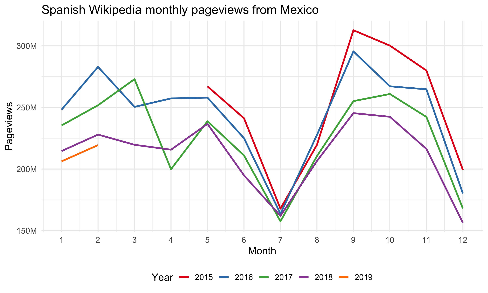

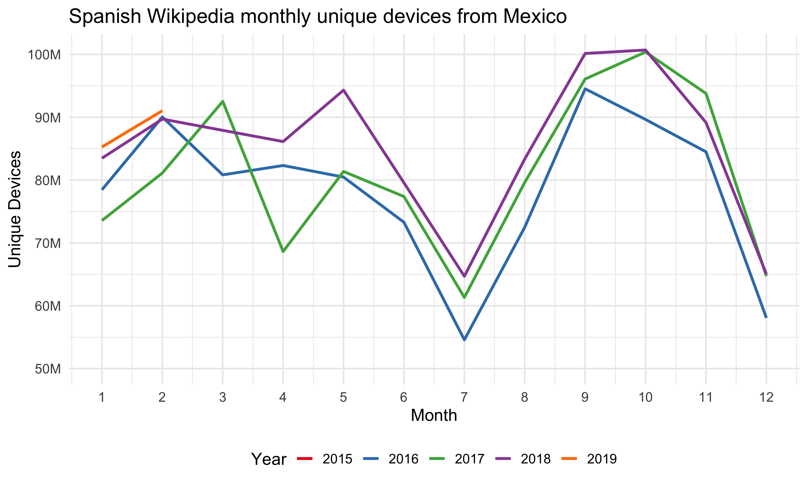

We also notice an interesting pattern in daily usage. The following graph of daily unique devices by country shows that users from Spain read more on the mobile devices during the weekends and they read more on desktop during weekdays, which is a pattern we saw consistently on other wikis as well. However, in Mexico and other Spanish speaking countries [^2], the usage pattern on desktop and mobile are very similar: high during weekdays and low during weekends. We see the same behaviors in page views data as well (see the [appendix][Graphs from exploratory data analysis]). Possible explanations for this unusual pattern are: 

- A lot of desktop users in these countries read the mobile version of the page; 
- A lot of mobile devices are used as "desktop" -- for example, students are more likely to use tablet than laptop, people are more likely to use tablet for their work, etc; 
- Users in these countries use Wikipedia for different purposes -- previous research[^3] show that the main driver for mobile users to read Wikipedia is conversations, and perhaps users in these countries don't see Wikipedia as a useful source for their topics. 

Further research is needed, and the result may provide better suggestions about how to approach readers in these Spanish speaking countries.

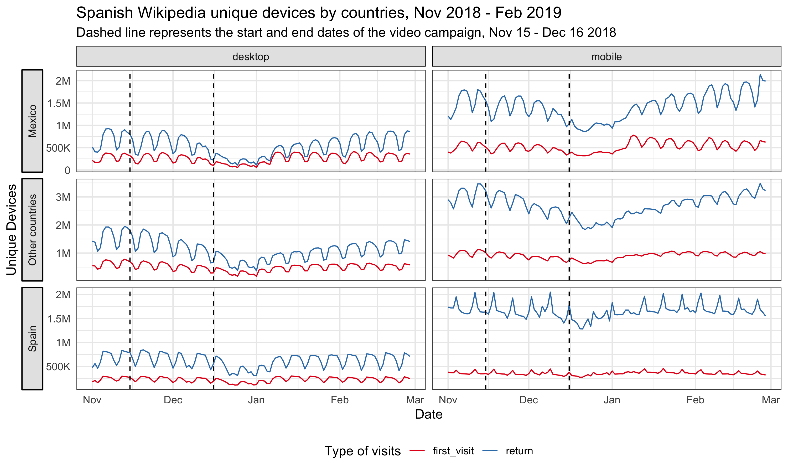

Lastly, from the breakdowns by wiki, the impressions and clickthroughs to Spanish Wikipedia on Google search result pages from Mexico (see the [appendix][Graphs from exploratory data analysis]), and the graphs above, we don't see any bumps during and after the video campaign.


[^2]: Here we include top 10 countries with most page views to Spanish Wikipedia, and top 10 countries whose official language is Spanish. See https://en.wikipedia.org/wiki/List_of_countries_where_Spanish_is_an_official_language
[^3]: https://cs.stanford.edu/people/jure/pubs/wikipedia-www17.pdf

# Methods

In the last section, we didn't see any significant bumps in traffic after the video campaigns, but it's possible that the campaign had some long term impact on the traffic to Spanish Wikipedia, e.g. Spanish speaking internet users from Mexico are more likely to clickthrough when they see Wikipedia on their search results pages. This kind of long term impact is what we care about most in this project -- improving the recognition of Wikipedia and the understanding of its uses.

In order to assess this hypothesis, we adopted a model-based approach to estimate the causal effect of the campaign on the page views and unique devices time series. With our test time series (page views and unique devices in Mexico) as the response variable, and a set of control time series (page views and unique devices in non-affected regions or non-affected wikis) as predictors, we constructed a [Bayesian structural time series model](https://en.wikipedia.org/wiki/Bayesian_structural_time_series). This model was then used to predict the counterfactual, i.e., how the response metric would have evolved after the intervention if the intervention had never occurred. We then calculated the difference between the synthetic counterfactual series and the observed test series for the post-intervention period (we choose 10 weeks in this analysis: 32 days of campaign and 38 days after the campaign) – which is the estimated impact of the campaign – and gauge its uncertainty by computing the posterior interval. We used the R packages [“bsts”](https://CRAN.R-project.org/package=bsts) (Scott et al., 2018) and ["CausalImpact"](https://CRAN.R-project.org/package=CausalImpact) (Brodersen et al., 2017)[^4] for modeling and inference.

[^4]: We make some changes to the package to use it with our custom BSTS model. See https://github.com/chelsyx/CausalImpact .

## Test and control series

The approach we described above is based on the following assumptions:

* There is a set of control time series that were themselves not affected by the intervention. If they were, we might falsely under- or overestimate the true effect. Or we might falsely conclude that there was an effect even though in reality there wasn't.
* The relationship between covariates and treated time series, as established during the pre-period, remains stable throughout the post-period.

Therefore, we used the Spanish Wikipedia page views and unique devices from Mexico as the test series, and used page views and unique devices from other countries [^2] to Spanish Wikipedia and other wikis[^5] as the control series. We tried both including and excluding the page views and unique devices to other wikis from Mexico in the set of control series to see how they affect the model performance and the significance of the impact, although including these series may violate the first assumption above because if the video campaign affect the brand awareness of Wikipedia the impact would likely be revealed on other wikis' traffic from the target region as well. We also analyzed a subset of the test and controls series -- the page views referred by search engines and external websites and the unique devices that visit our sites for the first time in 30 days (without cookies).

The authors of the *CausalImpact* library we use for estimating the models suggest using 3-50 covariates [^6]. Thus, for models in this work where we have hundreds of control series---e.g., many combinations of different regions and language editions---we use correlation and [dynamic time warping](https://en.wikipedia.org/wiki/Dynamic_time_warping) (DTW) algorithms with pre-intervention data to prescreen and trim the list of control series before feeding them into the BSTS model.

[^5]: Here we include the top 5 wikimedia projects in Mexico with the most page views.
[^6]: https://stats.stackexchange.com/questions/162930/causalimpact-should-i-use-more-than-one-control/163554#163554

## Model selection

Before fitting bayesian structural time series model on the whole pre-intervention data set, we perform cross validation to choose the best model configuration with time series before the intervention. We used 10-fold cross validation with 10 weeks in each fold, then compute and compare the [mean average percent error (MAPE)](https://en.wikipedia.org/wiki/Mean_absolute_percentage_error), [root mean square error (RMSE)](https://en.wikipedia.org/wiki/Root-mean-square_deviation) and [R squared](https://en.wikipedia.org/wiki/Coefficient_of_determination). To prevent the model from picking up spurious impact, we also computed the imaginary causal impact during validation period. We compared the estimated impact and its credible interval (the smaller the better), and we expected not to find a significant effect in the validation period, i.e., counterfactual estimates and actual data should agree reasonably closely.

We tried different combinations of the following model configuration:

- **Trend model**: For the trend component, we tried 1) local level trend 2) local linear trend, 3) semi-local linear trend, 4) a static intercept term.
- **Pre-intervention period**: Since there might be different factors influencing the relationship between covariates and treated time series, we also explore different pre-intervention period length: 12 weeks, 18 weeks, 183 days, 400 days, 600 days and 800 days.

Besides the above model parameters selected via grid-search, for each model in this work, we include a weekly and a monthly annual seasonality component, and a regression-based holiday component (including the following holidays: Holy week, Christmas and New year).

# Results

For both page views and unique devices of Spanish Wikipedia from Mexico, we do not detect a significant change during or after the campaign. 

## Page Views

For Spanish Wikipedia page views from Mexico, the best model has a local level trend with page views of other wikis[^5] from Mexico included. The pre-intervention period is 183 days, which means the time series starts on 16 May 2018 and includes daily page view data through 23 January 2019, where the intervention occurred on 15 November 2018. The validation statistics associated with the model provide an indication of how effective the model was at predicting the pre-intervention time series. With 10-fold cross validation and prediction evaluated on 10 weeks of daily page views (from the end of the pre-intervention period), the holdout mean absolute percentage error (MAPE) of this model is 7.38%.

In the plot below, the first panel shows the data (black solid line) and counterfactual prediction (blue dashed line) for the post-intervention period. The second panel shows the difference between observed data and counterfactual predictions. This is the point-wise causal effect, as estimated by the model. The third panel adds up the point-wise contributions from the second panel, resulting in a plot of the cumulative effect of the intervention. Shaded areas indicate 95% credible intervals. This graph shows that no significant impact on page views was detected during the campaign and in 38 days after the campaign ended. Page views of Spanish Wikibooks from Mexico and page views of Spanish Wikipedia from Ecuador are the most predictive control series in the model, with average standardized coefficients of 0.58 and 0.36 respectively. The posterior probabilities that their coefficients are different from zero are greater than 95%. 

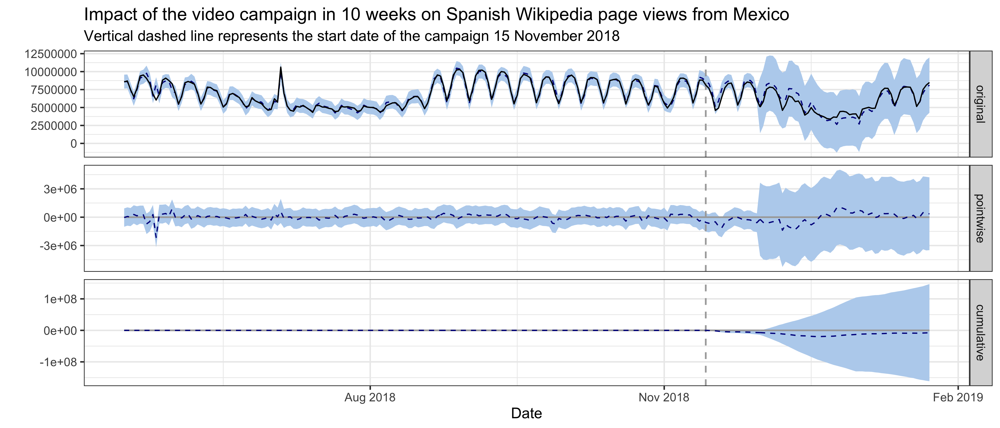

We also tried excluding Mexico page views of other wikis from the control series set. The average holdout MAPE from cross-validation is 10.57%, indicating the model performance is not as good as the previous one. And no significant impact is detected using this model neither.

For Spanish Wikipedia external referred page views from Mexico, the best model has a local level trend and the pre-intervention period is 400 days. The average holdout MAPE from cross-validation is 7.15%. This following graph shows that no significant impact on externally referred page views was detected following the intervention. Similarly, excluding Mexico externally-referred page views of other wikis from the control series set results in a worse model (MAPE = 10.09%), and no significant impact is detected using this model neither.

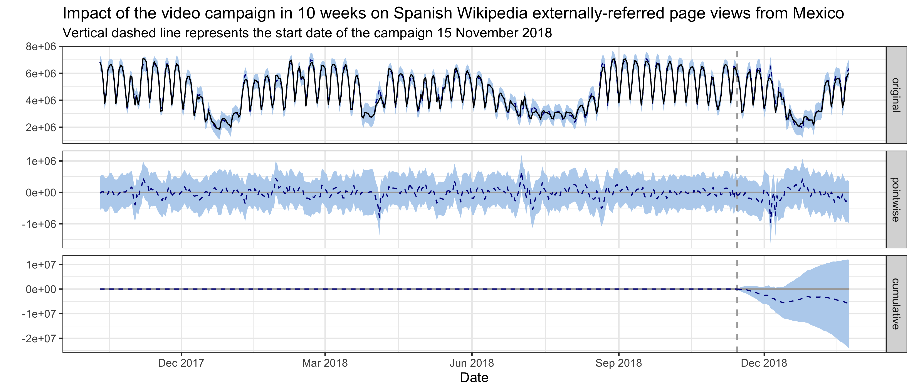

## Unique Devices

For Spanish Wikipedia unique devices from Mexico, the best model has a local level trend and the pre-intervention period is 600 days, which means the time series starts on 25 March 2017 and includes daily unique devices counts through 23 January 2019, where the intervention occurred on 15 November 2018. The average holdout MAPE from cross-validation is 5%. This following graph shows that no significant impact on unique devices was detected during the campaign and in 38 days after the campaign ended. Unique devices of es-wiki from Venezuela and Dominican Republic, unique devices of Spanish Wiktionary from Mexico and Dominican Republic, unique devices of Spanish Wikibooks from Mexico, are the most predictive control series in the model, with average standardized coefficients of 0.1, 0.29, 0.6, -0.26 and 0.37 respectively. The posterior probabilities that their coefficients are different from zero are greater than 95%. Similarly, excluding Mexico unique devices of other wikis from the control series set results in a worse model (MAPE = 7.83%), and no significant impact is detected using this model neither.

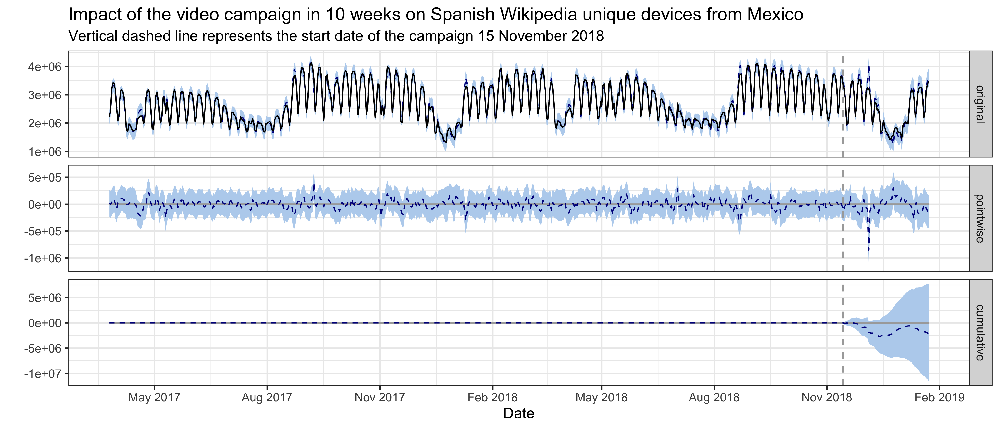

For Spanish Wikipedia first-time visit unique devices in 30 days from Mexico, the best model has a local level trend and the pre-intervention period is 600 days. The average holdout MAPE from cross-validation is 4.48%. This following graph shows that no significant impact on first-time visit unique devices was detected following the intervention. Similarly, excluding Mexico first-time visit unique devices of other wikis from the control series set results in a worse model (MAPE = 7.95%), and no significant impact is detected using this model neither.

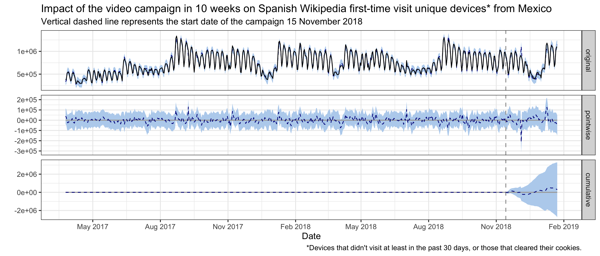

Last but not least, further research and model tuning is needed to improve the accuracy of the estimation. See the [discussion part of the Hindi Wikipedia report](https://wikimedia-research.github.io/Audiences-New_Readers-Hindi_Video_Campagin-April_2018/#discussion) in which we used the same methodologies.

# Reference

## Reading

<ol>
<li id="ref-1">Scott, S. L., and Varian, H. R. (2014). Predicting the present with bayesian structural time series. International Journal of Mathematical Modelling and Numerical Optimisation, 5(1/2), 4. http://doi.org/10.1504/ijmmno.2014.059942</li>
<li id="ref-2">Brodersen, K. H., Gallusser, F., and Koehler, J. (2015). Inferring causal impact using Bayesian structural time-series models. The Annals of Applied Statistics. http://doi.org/10.1214/14-AOAS788, http://research.google.com/pubs/pub41854.html</li>
<li id="ref-3">Larsen, K. (2016, January 13). Making Causal Impact Analysis Easy [Blog post]. Retrieved from http://multithreaded.stitchfix.com/blog/2016/01/13/market-watch/</li>
<li id="ref-4">Larsen, K. (2016, April 21). Sorry ARIMA, but I’m Going Bayesian [Blog post]. Retrieved from http://multithreaded.stitchfix.com/blog/2016/04/21/forget-arima/</li>
<li id="ref-5">Scott, S. L. (2017, July 11). Fitting Bayesian structural time series with the bsts R package [Blog post]. Retrieved from http://www.unofficialgoogledatascience.com/2017/07/fitting-bayesian-structural-time-series.html</li>
</ol>

## Software

```{r packages_refs, results = 'asis'}
c("base", "bsts", "dtw", "CausalImpact", "ggplot2", "rmarkdown", "knitr") %>%
  lapply(function(pkg) { return(format(citation(package = pkg), "text")) }) %>%
  unlist %>%
  {
    paste0("<li id=\"ref-", (1:length(.)) + 5, "\">", ., "</li>")
  } %>%
  paste(collapse = "") %>%
  gsub("<URL:", "", ., fixed = TRUE) %>%
  gsub(">.", "", ., fixed = TRUE) %>%
  paste0("<ol start = \"6\" style = \"list-style-type: decimal\">", ., "</ol>", collapse = "") %>%
  gsub("\n", "", .) %>%
  cat
```

# Appendix

## Graphs from exploratory data analysis

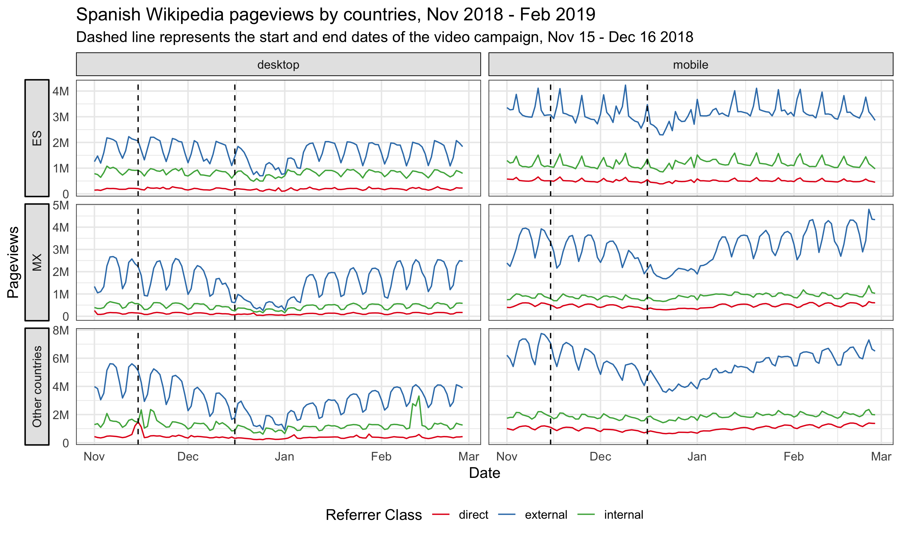

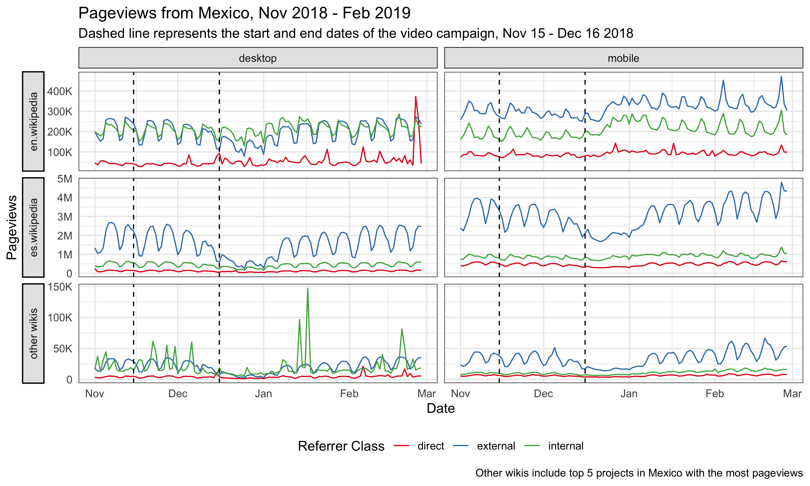

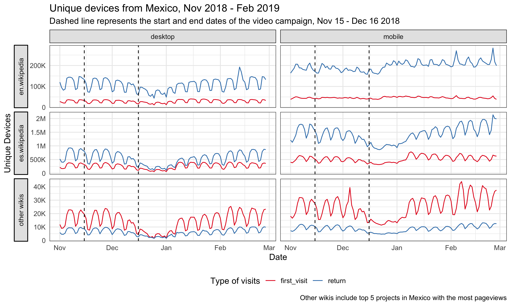

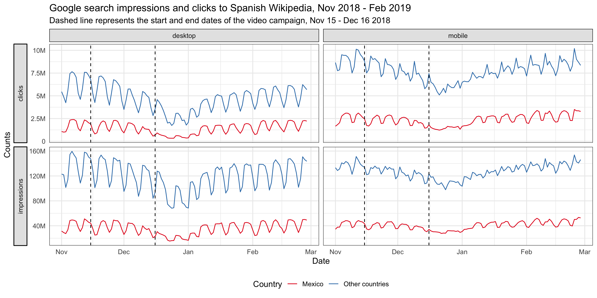

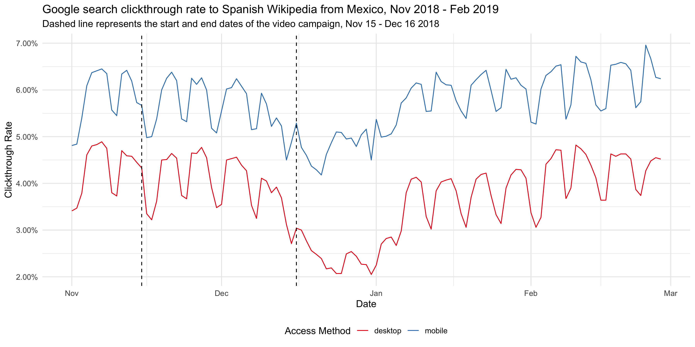
